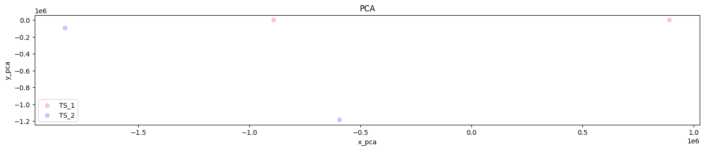
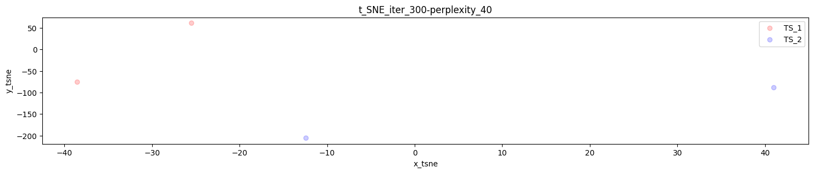
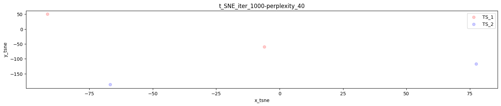

## Project Description

SimilarityTS is an open-source project designed to facilitate the evaluation and comparison of
multivariate time series data. It provides a comprehensive toolkit for analyzing, visualizing, and reporting multiple
metrics and figures derived from time series datasets. The toolkit simplifies the process of evaluating the similarity of
time series by offering data preprocessing, metrics computation, visualization, statistical analysis, and report generation
functionalities. With its customizable features, SimilarityTS empowers researchers and data
scientists to gain insights, identify patterns, and make informed decisions based on their time series data.

### Available metrics

This toolkit can compute the following metrics:

- `kl`: Kullback-Leibler divergence
- `js`: Jensen-Shannon divergence
- `ks`: Kolmogorov-Smirnov test
- `mmd`: Maximum Mean Discrepancy
- `dtw` Dynamic Time Warping
- `cc`: Difference of co-variances
- `cp`: Difference of correlations
- `hi`: Difference of histograms

### Available figures

This toolkit can generate the following figures:

- `2D`: the ordinary graphical representation of the time series in a 2D figure with the time represented on the x axis
  and the data values on the y-axis for
    - the complete multivariate time series; and
    - a plot per column.

  Each generated figure plots both the original and the synthetically generated data to easily obtain key insights into
  the similarities or differences between them.
- `delta`: the differences between the values of each column grouped by periods of time. For instance, the differences
  between the cpu usage every 5 minutes or every 30 minutes. These delta can be used as a means of comparison between
  time series short-/mid-/long-term patterns.
  .png)
  .png)
  .png)
- `pca`: the linear dimensionality reduction technique that aims to find the principal components of a data set by
  computing the linear combinations of the original characteristics that explain the most variance in the data.
  
- `tsne`: a tool for visualising high-dimensional data sets in a 2D or 3D graphical representation allowing the creation
  of a single map that reveals the structure of the data at many different scales.
  
  
- `dtw` path: In addition to the numerical similarity measure, the graphical representation of the DTW path of each
  column can be useful to better analyse the similarities or differences between the time series columns. Notice that
  there is no multivariate representation of DTW paths, only single column representations.
  

## Installation as a python binary

To get started, follow these steps to install the toolkit:

### Step 1. Install the tool in your local environment:

```Bash
pip install similarity-ts-cli 
```

## Usage

Users must provide `.csv` files containing multivariate time series by using the arguments `-ts1` and `-ts2_path`.

- `-ts1` should point to a single `csv` filename. This time series may represent the baseline or ground truth time
  series.
- `-ts2_path` can point to another single `csv` filename or a directory that contains multiple `csv` files to be
  compared with `-ts1` file.
- `-head` if your time series files include a header this argument must be present. If not present, the software
  understands that csv files don't include a header row.

Constraints:

- `-ts1` time-series file and `-ts2_path` time-series file(s) must:
    - have the same dimensionality (number of columns)
    - not include a timestamp column
    - include only numeric values
    - include the same header (if present)
- if a header is present as first row, use the `-head` argument
- all `-ts2_path` time-series files must have the same length (number of rows).

Note: the column delimiter is automatically detected.

If `-ts1` time-series file is longer (more rows) than `-ts2_path` time-series file(s), the `-ts1` time series will be
divided in windows of the same
length as the `-ts2_path` time-series file(s).

For each `-ts2_path` time-series file, the most similar window (*) from `-ts1` time series is selected.

Finally, metrics and figures that assess the similarity between each pair of `-ts2_path` time-series file and its
associated most similar `-ts1` window are computed.

(*) `-w_select_met` is the metric used for the selection of the most
similar `-ts1` time-series window per each `--ts2_path` time-series file(s).`dtw` is the default value, however, any of
the
[metrics](#available-metrics) are also available for this purpose using this argument.

Users can provide metrics or figures to be computed/generated:

- `-m` the [metrics](#available-metrics) names to be computed as a list separated by spaces.
- `-f` the [figures](#available-figures) names to be computed as a list separated by spaces

If no metrics nor figures are provided, the tool will compute all the available metrics and figures.

The following arguments are also available for fine-tuning:

- `-ts_freq_secs` the frequency in seconds in which samples were taken just to generate the delta figures. By default is
  `1` second.
- `-strd` when `ts1` time-series is longer than `ts2_path` time-series file(s) the windows are computed by using a
  stride of `1` by default. Sometimes using a larger value for the stride parameter improves the performance by skipping
  the computation of similarity between so many windows.

### Basic usage examples:

Some examples of evaluation of similarity are shown below. You can download some test data 
    ```Bash
    wget https://github.com/alejandrofdez-us/similarity-ts-cli/raw/main/data_samples.zip && unzip data_samples.zip
    ```
Or manually download and unzip from https://github.com/alejandrofdez-us/similarity-ts-cli/raw/main/data_samples.zip .

1. Two time series computing all metrics and figures:
    ```Bash
    similarity-ts-cli -ts1 data_samples/example_1.csv -ts2 experiments/mini_example_1.csv
    ```

1. Two time series computing only DTW metric and DTW figure:
    ```Bash
    similarity-ts-cli -ts1 data_samples/example_1.csv -ts2_path experiments/mini_example_1.csv -m dtw -f dtw
    ```

1. A time series and all time series within a directory computing only DTW metric and DTW figure::
    ```Bash
    similarity-ts-cli -ts1 data_samples/example_1.csv -ts2_path experiments -m dtw -f dtw
    ```

1. A time series and all time series within a directory computing every metric and figure available:
    ```Bash
    similarity-ts-cli -ts1 data_samples/example_1.csv -ts2 experiments -m js mmd dtw ks kl cc cp hi -f delta dtw 2d pca tsne
    ```

1. Comparison using filenames whose first rows are used as headers (all filenames must contain the same header):
    ```Bash
    similarity-ts-cli -ts1 data_samples/example_1.csv -ts2 experiments -m dtw -f dtw -head
    ```

1. Comparison between time series specifying the frequency in seconds in which samples were taken:
    ```Bash
    similarity-ts-cli -ts1 data_samples/example_1.csv -ts2_path experiments -m dtw -f dtw -ts_freq_secs 60
    ```

1. Comparison between time series specifying the stride that determines the step or distance by which a fixed-size
   window moves over the first time series:
    ```Bash
    similarity-ts-cli -ts1 data_samples/example_1.csv -ts2_path experiments -m dtw -f dtw -strd 5
    ```

1. Comparison between time series specifying the window selection metric to be used when selecting the most similar
   windows in
   the first time series:

    ```Bash
    similarity-ts-cli -ts1 data_samples/example_1.csv -ts2_path experiments -m dtw -f dtw -w_select_met js
    ```

1. Using our sample time series to compute every single metric and figure:

    ```Bash
    similarity-ts-cli -ts1 data_samples/sample_1.csv -ts2_path experiments -head -m mmd dtw ks kl cc cp hi -f delta dtw 2d pca tsne -w_select_met cc -ts_freq_secs 60 -strd 5
    ```

Every metric computation will be found in the `results` directory and every figure generated will be found at `figures`
directory.

## Advanced usage

Additionally, users may implement their own metric or figure classes and include them within the `metrics` or `plots`
directory. To ensure compatibility with our framework, they have to inherit from the base classes (`Metric` and `Plot`).

The following code snippet is an example of a new metric:

```Python

```

This allows the framework to dynamically recognize and utilize these custom classes based on user input. By including
them in the argument parser, users can easily select their custom metrics or plots when running the framework, ensuring
that their classes are properly integrated and applied during the time series evaluation process.

## License

Time Series Evaluation Framework is free and open-source software licensed under the [MIT license](LICENSE).